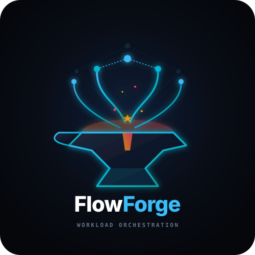
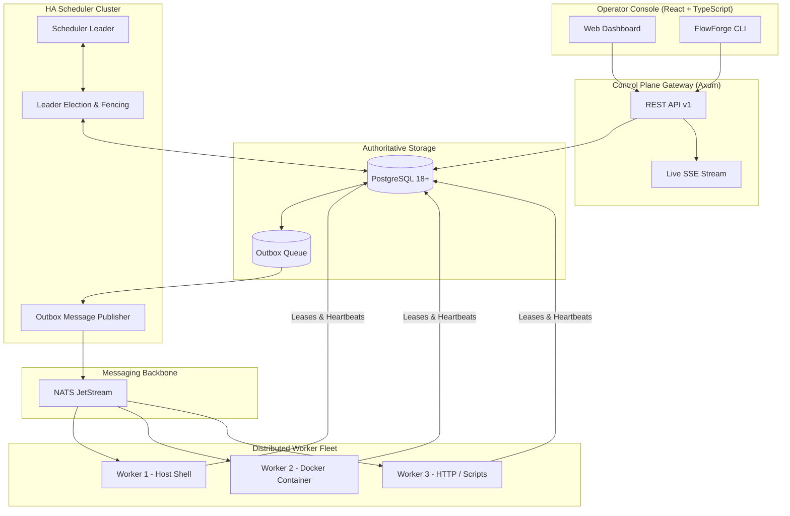

<div align="center">
  
  <h1>⚡ FlowForge</h1>
  <p><strong>Cloud-Native, Rust-Powered Distributed Workload Orchestration Platform</strong></p>
  <p>Scheduled, event-driven, observable and fault-tolerant workflow automation across containers, Kubernetes, servers, scripts and APIs.</p>

  <p>
    <!-- CI / CD Status Badges -->
    <a href="https://github.com/sarkarbikram90/FlowForge/actions/workflows/ci.yml">
      
    </a>
    <a href="https://github.com/sarkarbikram90/FlowForge/actions/workflows/security.yml">
      
    </a>
    <a href="https://github.com/sarkarbikram90/FlowForge/actions/workflows/e2e.yml">
      
    </a>
    <a href="https://github.com/sarkarbikram90/FlowForge/actions/workflows/release.yml">
      
    </a>
  </p>

  <p>
    <!-- Quality & Security Governance -->
    <a href="deny.toml">
      
    </a>
    <a href="audit.toml">
      
    </a>
    <a href="https://github.com/sarkarbikram90/FlowForge/blob/main/ui/package.json">
      
    </a>
    <a href="https://github.com/sarkarbikram90/FlowForge/actions/workflows/ci.yml">
      
    </a>
    <a href="LICENSE">
      
    </a>
  </p>

  <p>
    <!-- Tech Stack Badges -->
    
    
    
    
    
    
    
    
  </p>

  <p>
    <!-- GitHub Community & Stats -->
    <a href="https://github.com/sarkarbikram90/FlowForge/releases">
      
    </a>
    <a href="https://github.com/sarkarbikram90/FlowForge/stargazers">
      
    </a>
    <a href="https://github.com/sarkarbikram90/FlowForge/network/members">
      
    </a>
    <a href="https://github.com/sarkarbikram90/FlowForge/issues">
      
    </a>
  </p>
</div>

---

## 🌟 Key Highlights

- **Rust-Native Core**: High-throughput async control plane built with Tokio, Axum, SQLx, and Petgraph.
- **Transactional Outbox & NATS JetStream**: Zero lost messages and guaranteed crash consistency using the transactional outbox pattern.
- **High-Availability Distributed Scheduler**: Active-passive scheduler cluster with distributed PostgreSQL leader election and monotonic fencing tokens.
- **State Machine Enforcement**: Formal workflow and task state transitions preventing invalid terminal mutations or split-brain executions.
- **Durable Worker Leases & Auto-Recovery**: Tasks are bound to renewable leases. Stale or crashed workers are automatically detected, tasks transitioned to `LOST`, and requeued according to configurable exponential backoff with jitter.
- **Modern Operator Dashboard**: High-performance dark-mode TypeScript console featuring live DAG visualization, Gantt execution timelines, streaming terminal logs, and fleet telemetry.
- **Production Hardened**: Native Kubernetes Helm charts with PodDisruptionBudgets, NetworkPolicies, and horizontal autoscaling.

---

## 🏗️ Architecture



---

## 📦 Workspace Crates

```text
crates/
├── common/             # Domain models, state machines, retry backoff with jitter
├── workflow-engine/    # DAG validation, cycle detection, critical path, compiler
├── execution-engine/   # TaskExecutor trait (Shell, Container, HTTP, Script, Wait)
├── persistence/        # SQLx migrations, DB repositories, outbox, leases
├── messaging/          # NATS JetStream messaging, pull consumers, outbox publisher
├── auth/               # Multi-tenancy, RBAC roles & permissions, API keys
├── observability/      # OpenTelemetry tracing, Prometheus metrics, structured logs
├── scheduler/          # HA leader election, cron trigger engine, stale lease reaper
├── worker/             # Distributed worker agent, heartbeat, task pull loop, draining
├── api/                # Axum REST API v1, SSE live stream, OpenAPI 3.1
├── cli/                # Clap-based command line interface
└── chaos-tests/        # Automated resilience, leader failover & crash test suite
```

---

## 🚀 Quickstart

### 1. Build and Run Tests
```bash
# Run all unit tests and chaos test suites
cargo test --workspace

# Build optimized release binaries
cargo build --release --workspace
```

### 2. Start Local Development Stack
```bash
# Start PostgreSQL, NATS JetStream, MinIO and OTel Collector
make dev-infra

# Run API Gateway locally
make dev-api

# Run HA Scheduler
make dev-scheduler

# Run Worker Agent
make dev-worker

# Run Frontend UI
make dev-ui
```

### 3. Apply Workflow via CLI
```bash
# Apply example workflow
cargo run -p flowforge-cli -- workflow apply --file examples/daily-etl-pipeline.yaml

# Trigger execution run
cargo run -p flowforge-cli -- run trigger daily-etl-pipeline

# View platform status
cargo run -p flowforge-cli -- status
```

---

## 🛡️ Production Deployment (Kubernetes / Helm)

```bash
helm install flowforge ./deploy/helm/flowforge
```

---

## 📜 License

Licensed under either of:

- Apache License, Version 2.0 ([LICENSE-APACHE](LICENSE) or http://www.apache.org/licenses/LICENSE-2.0)
- MIT license ([LICENSE-MIT](LICENSE) or http://opensource.org/licenses/MIT)

at your option.
