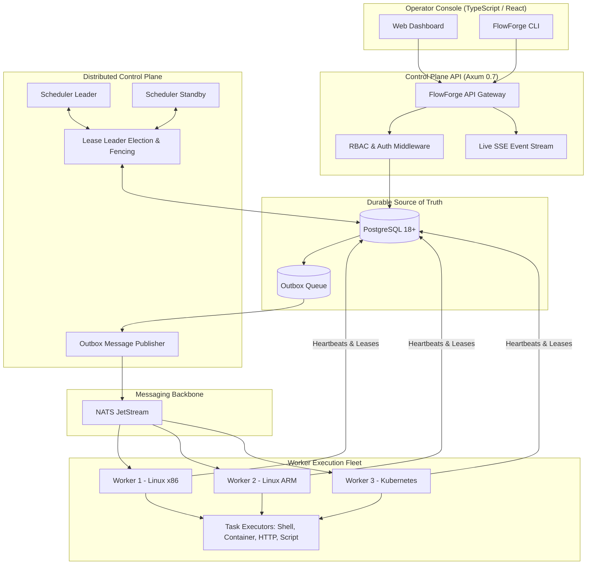

# FlowForge Architecture

FlowForge is a production-grade, distributed workload orchestration platform built with Rust, PostgreSQL, NATS JetStream, and a modern TypeScript operator console.

---

## 1. High-Level Architecture Diagram

---

## 2. Core Architectural Invariants

1. **PostgreSQL as Single Source of Truth**: The database stores canonical workflow state machines, immutable workflow definitions, run history, and worker registrations.
2. **Transactional Outbox Pattern**: State transitions and outgoing message dispatches occur in the same database transaction, eliminating dual-write inconsistencies.
3. **Application-Level Idempotency**: All workflow runs and task execution messages contain unique execution keys (`idempotency_key`, `task_run_id`, `attempt_id`).
4. **HA Scheduler with Distributed Leases**: Schedulers run as active-passive clusters with PostgreSQL lease-based leader election and monotonic fencing tokens (`lease_version`).
5. **Durable Worker Leases**: Every executing task is protected by a renewable 30-second lease. If a worker crashes, the lease expires and the task is re-queued according to its retry policy.
