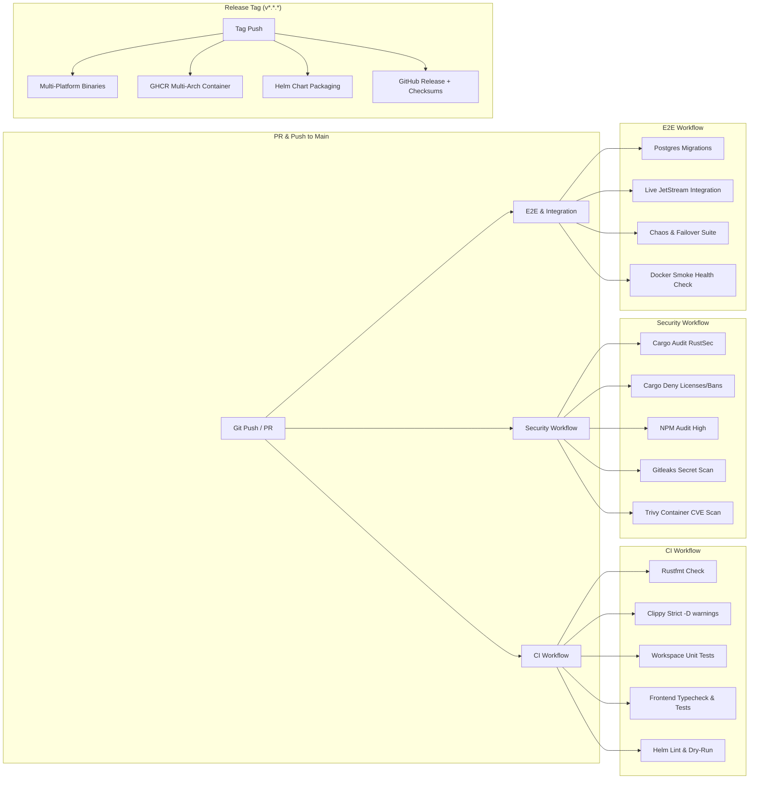

# FlowForge CI/CD & Engineering Pipeline Architecture

FlowForge uses a multi-tier production-grade continuous integration, continuous delivery, security audit, and distribution pipeline built with **GitHub Actions**, **Docker Buildx**, **Helm**, and **Cargo**.

---

## 1. Pipeline Overview



---

## 2. Workflows Reference

### A. `.github/workflows/ci.yml` (Main CI)
- **Rust Quality**:
  - `cargo fmt --all -- --check`
  - `cargo clippy --workspace --all-targets --all-features -- -D warnings`
  - `cargo check --workspace --all-targets --all-features`
- **Rust Cross-Platform Test Matrix**:
  - `ubuntu-latest`, `windows-latest`, `macos-latest`
  - Workspace test execution and chaos failure injection.
- **Frontend UI Quality**:
  - TypeScript strict `tsc --noEmit`
  - Vitest component and UI unit tests with jsdom
  - Production Vite bundle compilation (`npm run build`)
- **Helm Validation**:
  - Helm chart linting and dry-run template rendering.

### B. `.github/workflows/security.yml` (Supply Chain & CVEs)
- **Cargo Audit**: Checks all Rust dependencies against the RustSec Advisory Database.
- **Cargo Deny**: Enforces license whitelist (MIT, Apache-2.0, BSD-3-Clause, ISC, etc.), dependency bans, and duplicate crate checks.
- **NPM Audit**: Blocks vulnerabilities with severity `>= high` in UI dependencies.
- **Gitleaks**: Scans commit history for accidentally leaked tokens, keys, or passwords.
- **Trivy**: Scans multi-stage production container images for OS and library CVEs.

### C. `.github/workflows/e2e.yml` (E2E & Integration)
- **Live Infrastructure Services**:
  - PostgreSQL 16 Alpine (`postgres:16-alpine`)
  - NATS JetStream 2.10 (`nats:2.10-alpine -js`)
  - MinIO S3 Object Storage (`minio/minio:latest`)
- **Database Migrations Execution**:
  - Applies `migrations/*.sql` to the live database instance before executing test suites.
- **Production Container Smoke Test**:
  - Builds Docker image and verifies `/api/v1/health/live` and `/api/v1/health/ready` HTTP probes.

### D. `.github/workflows/release.yml` (Release & Distribution)
- Triggered automatically on `v*.*.*` git tags.
- **Cross-Platform Binaries**:
  - Linux AMD64 (`x86_64-unknown-linux-gnu`)
  - Linux ARM64 (`aarch64-unknown-linux-gnu`)
  - Windows AMD64 (`x86_64-pc-windows-msvc`)
  - macOS Intel (`x86_64-apple-darwin`)
  - macOS Apple Silicon (`aarch64-apple-darwin`)
- **Multi-Arch Docker Images**:
  - Pushed to `ghcr.io/sarkarbikram90/flowforge:latest` and version tags.
- **Helm Chart OCI Packaging**:
  - Packages and uploads `flowforge-<version>.tgz`.
- **SHA256 Checksums**:
  - Generates `SHA256SUMS.txt` for all release artifacts.

---

## 3. Local Developer Validation Commands

You can run the exact pipeline checks locally before opening a pull request:

```bash
# Format & Lint
make fmt-check
make clippy

# Compilation & Tests
make check
make test
make test-chaos

# Frontend Checks
make ui-check
make ui-test
make ui-build

# Helm & Container Smoke Test
make helm-lint
make docker-build
```
