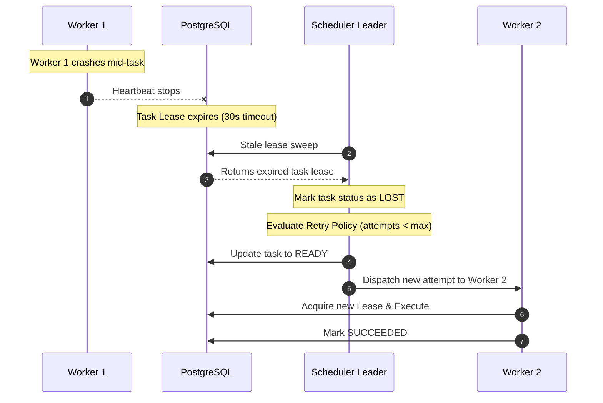

# FlowForge Failure Modes and Automatic Recovery

## 1. Failure Scenarios and Guarantees

### Automatic Recovery Guarantees
1. **Worker Crash / Loss**: Monitored via 30s leases. Tasks are transitioned to `LOST` and automatically requeued.
2. **Scheduler Crash / Leader Loss**: Standby schedulers automatically acquire the lease within 2 seconds.
3. **Duplicate Message Redelivery**: Application-level idempotency prevents double execution or conflicting completions.
4. **Network Partitioning**: Fencing tokens reject stale writes from isolated components.
